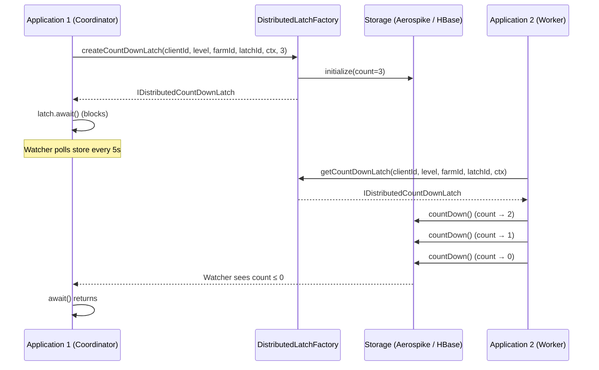

# Distributed Latch

Distributed Latch is a lightweight Java library for coordinating count-based synchronization across multiple application instances in a distributed environment — similar to Java's `CountDownLatch`, but backed by a distributed storage layer.

## Why Distributed Latch?

In service-oriented architectures, it is common to need a coordination primitive that blocks one or more threads until a set of operations in other services or instances completes. Java's built-in `CountDownLatch` only works within a single JVM. Distributed Latch extends this concept across process and machine boundaries.

## Key Features

- **CountDown Latch** — uni-directional permit movements (decrement only). Ideal for fan-out / fan-in patterns.
- **CountUpDown Latch** — bi-directional permit movements (increment and decrement). Useful when the total work is not known upfront.
- **Latch levels** — `DC` (single data center) and `XDC` (cross data center) scoping.
- **Pluggable storage backends** — Aerospike and HBase out of the box.
- **Blocking await** — `await()` blocks until the count reaches zero, with optional timeout.
- **Built-in watcher** — a background poller monitors the count in the storage layer and unblocks the local latch when the count reaches zero.
- **Automatic TTL** — latch records expire in the storage layer even if the application crashes.
- **Built-in retry** — configurable retry with backoff on transient storage failures (Aerospike).

## How It Works

### Latch Identity Scoping

Each latch identity is scoped to a **client**. Internally the latch key is stored as `D_LTCH#<clientId>#<latchId>`, so two different clients can independently use the same logical latch ID without conflict.

### Latch Lifecycle

1. **Create** — `DistributedLatchFactory.createCountDownLatch(...)` initializes the count in the store.
2. **Count Down / Up** — workers call `countDown()` (or `countUp()` for up-down latches) to modify the count.
3. **Await** — the coordinator calls `await()` which starts a background watcher polling the store every 5 seconds.
4. **Release** — when the count reaches zero (or below), the watcher unblocks the local `CountDownLatch` and stops polling.

## What to Read Next

- [Getting Started](getting-started.md) — dependency setup, prerequisites, building locally.
- [Usage](usage.md) — factory methods, countdown, countup, await, and complete examples.
- [Latch Semantics](latch-semantics.md) — API reference, latch levels, watcher behavior, error codes.
- [Storage Backends](storages/aerospike.md) — Aerospike and HBase internals.

