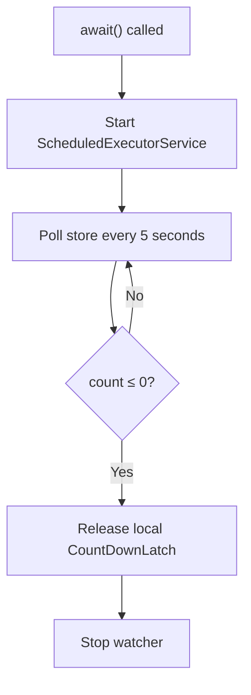

# Latch Semantics

## Latch Levels

Distributed Latch supports two latch levels that control the scope of count isolation:

### `DC` — Data Center

Latches scoped to a single data center. The count is stored per `farmId`:

- **Aerospike** — bin name: `count#<farmId>`
- **HBase** — column qualifier: `count_<farmId>`

Use `DC` latches when all coordinating instances are within the same data center. This is the **recommended default** for most workloads.

### `XDC` — Cross Data Center

Latches scoped across data centers. When reading the count with `XDC`, the library **sums all farm-specific count bins/columns** to produce the total count.

Use `XDC` when instances in different data centers must coordinate on the same latch.

!!! warning "XDC consistency"
    Reading an `XDC` count aggregates across all farms. Due to storage replication lag, the count may be temporarily inconsistent across data centers.

    - **Aerospike** — use a strong-consistency namespace or a multi-site cluster.
    - **HBase** — ensure a single-region deployment or synchronous replication.

## Latch Types

### CountDown Latch (`IDistributedCountDownLatch`)

Permits only **decrement** operations. Analogous to Java's `java.util.concurrent.CountDownLatch`.

| Method | Description |
|--------|-------------|
| `init(long count)` | Initialize the count in the distributed store. Called automatically by `createCountDownLatch`. |
| `getCount()` | Read the current count from the store. |
| `countDown()` | Decrement the count by 1. |
| `await()` | Block until the count reaches zero. |
| `await(long time, TimeUnit unit)` | Block until the count reaches zero or the timeout expires. Returns `true` if count reached zero. |

### CountUpDown Latch (`IDistributedCountUpDownLatch`)

Extends `IDistributedCountDownLatch` with an additional **increment** operation.

| Method | Description |
|--------|-------------|
| `countUp()` | Increment the count by 1. |
| *(all methods from CountDown Latch)* | Inherited. |

## Watcher Behavior

When `await()` or `await(time, unit)` is called, the latch starts a **background watcher**:

- The watcher uses a `ScheduledExecutorService` with a **fixed-rate** schedule of **5 seconds**.
- On each poll, it reads the count from the storage backend.
- When the count reaches zero or below, it:
    1. Counts down the local `java.util.concurrent.CountDownLatch` (releasing any waiting thread).
    2. Cancels the scheduled polling task.

!!! info "Polling interval"
    The 5-second polling interval is currently fixed. The watcher does **not** use push-based notifications (e.g. Aerospike change notifications or HBase coprocessors) — it relies on periodic reads.

## Factory Method Reference

| Method | Returns | Description |
|--------|---------|-------------|
| `createCountDownLatch(clientId, level, farmId, latchId, ctx, count)` | `IDistributedCountDownLatch` | Creates a new latch and initializes the count in the store. |
| `createCountUpDownLatch(clientId, level, farmId, latchId, ctx, count)` | `IDistributedCountUpDownLatch` | Creates a new up-down latch and initializes the count in the store. |
| `getCountDownLatch(clientId, level, farmId, latchId, ctx)` | `IDistributedCountDownLatch` | Returns a reference to an existing latch. Does **not** initialize the count. |
| `getCountUpDownLatch(clientId, level, farmId, latchId, ctx)` | `IDistributedCountUpDownLatch` | Returns a reference to an existing up-down latch. Does **not** initialize the count. |
| `getOrCreateCountUpDownLatch(clientId, level, farmId, latchId, ctx)` | `IDistributedCountUpDownLatch` | Creates the latch with count=0 if it doesn't exist; returns a reference if it does. |

## Error Codes

All errors are surfaced as `DistributedLatchException` with one of the following codes:

| Error Code | When It Occurs |
|------------|----------------|
| `INTERNAL_ERROR` | Catch-all for unexpected failures (I/O errors, retry exhaustion, etc.). |
| `NOT_IMPLEMENTED` | The requested operation is not supported by the current storage backend. |

### Exception Propagation

`DistributedLatchException.propagate(throwable)` unwraps nested `DistributedLatchException` instances so you always receive the original error code rather than a wrapped `INTERNAL_ERROR`.

## Thread Safety

- `DistributedLatchFactory` is a stateless utility class — all methods are static and thread-safe.
- Each latch instance contains its own local `CountDownLatch` and `ScheduledExecutorService`. Do **not** share a single latch instance across threads for concurrent `await()` calls — create separate instances per thread.
- `countDown()` and `countUp()` are safe to call from any thread — they perform atomic operations on the distributed store.

