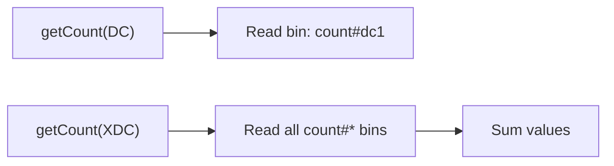

# Aerospike Backend

Use `AerospikeLatchStorage` when your workload needs low-latency latch operations backed by Aerospike's in-memory storage.

## Configuration

```java
AerospikeLatchStorageContext storageContext = AerospikeLatchStorageContext.builder()
    .aerospikeClient(aerospikeClient)   // IAerospikeClient instance
    .namespace("latches")               // Aerospike namespace
    .setSuffix("distributed_latch")     // suffix used in set name
    .storageType(StorageType.AEROSPIKE) // storage type
    .ttl(3600)                          // TTL in seconds
    .build();
```

| Parameter          | Type               | Description |
|--------------------|--------------------|-------------|
| `aerospikeClient`  | `IAerospikeClient` | An already-connected Aerospike client. The library does **not** manage the client lifecycle. |
| `namespace`        | `String`           | The Aerospike namespace where latch records are stored. Must already exist on the cluster. |
| `setSuffix`        | `String`           | Suffix appended to the set name. The full set name is `D_LTCH#<setSuffix>`. |
| `storageType`      | `StorageType`      | Must be `StorageType.AEROSPIKE`. |
| `ttl`              | `int`              | Time-to-live in seconds for latch records. After expiry, the record is automatically removed. |

## How It Works

### Initialization (`init`)

When `createCountDownLatch` or `createCountUpDownLatch` is called, the factory initializes the count in Aerospike:

1. A `WritePolicy` is created with `RecordExistsAction.CREATE_ONLY` — ensuring the latch is initialized only once.
2. The `expiration` is set to the configured TTL.
3. A single bin `count#<farmId>` is written with the initial count value.

If the record already exists, Aerospike throws `KEY_EXISTS_ERROR`. For `getOrCreateCountUpDownLatch`, this error is silently handled.

### Count Operations

- **`countDown()`** — issues an `Operation.add` with value `-1` on the count bin. Uses `RecordExistsAction.UPDATE_ONLY`.
- **`countUp()`** — issues an `Operation.add` with value `+1` on the count bin. Uses `RecordExistsAction.UPDATE_ONLY`.

Both operations are **atomic** at the Aerospike server level.

### Count Reading

- **`DC` level** — reads the specific `count#<farmId>` bin.
- **`XDC` level** — reads all bins whose name starts with `count#`, then **sums** their values to produce the aggregate count.



## Set Naming

The Aerospike set name is constructed as:

```
D_LTCH#<setSuffix>
```

All latch records (across farms and clients) share the same set. Isolation is achieved via the record key: `D_LTCH#<clientId>#<latchId>`.

## Retry Behavior

All Aerospike operations are wrapped in a `guava-retrying` retryer:

| Setting | Read Operations | Write Operations |
|---------|----------------|-----------------|
| Retry on | `AerospikeException` | `AerospikeException` |
| Max attempts | 5 | 5 |
| Wait between attempts | 10 ms (fixed) | 10 ms (fixed) |
| Block strategy | Thread sleep | Thread sleep |

If all retries are exhausted, a `DistributedLatchException` with `ErrorCode.INTERNAL_ERROR` is thrown.

## Bin Layout

Each latch record contains one bin per farm:

| Bin Name | Type | Content |
|----------|------|---------|
| `count#<farmId>` | Long | Current count value for the given farm. |

For a latch used across two farms (`dc1` and `dc2`), the record would have two bins: `count#dc1` and `count#dc2`.

## Watcher

The Aerospike storage uses a `ScheduledExecutorService` to poll the count every **5 seconds**. When the count reaches zero or below, the watcher:

1. Releases the local `CountDownLatch`.
2. Cancels the scheduled future.

