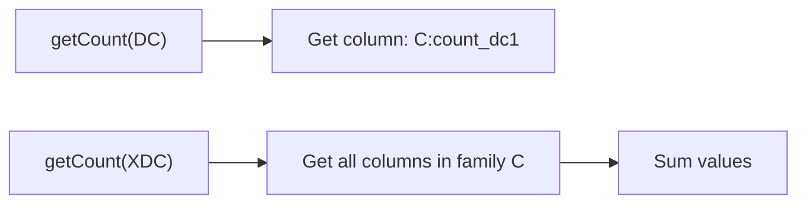

# HBase Backend

Use `HBaseLatchStorage` when your platform standard is Apache HBase and you need latch operations backed by HBase's atomic `Increment`.

## Configuration

```java
HBaseLatchStorageContext storageContext = HBaseLatchStorageContext.builder()
    .connection(hbaseConnection)        // org.apache.hadoop.hbase.client.Connection
    .tableSuffix("distributed_latch")   // HBase table suffix
    .storageType(StorageType.HBASE)     // storage type
    .ttl(3600)                          // TTL in seconds
    .build();
```

| Parameter     | Type         | Description |
|---------------|--------------|-------------|
| `connection`  | `Connection` | An already-established HBase connection. The library does **not** create the connection. |
| `tableSuffix` | `String`     | Suffix for the HBase table name. The full table name is `D_LTCH_<tableSuffix>`. |
| `storageType` | `StorageType`| Must be `StorageType.HBASE`. |
| `ttl`         | `int`        | Time-to-live in seconds. Converted to milliseconds and set as cell-level TTL on writes. |

## Initialization — Auto Table Creation

When `init(count)` is called, `HBaseLatchStorage` checks whether the table exists and creates it if needed:

```java
TableDescriptor tableDescriptor = TableDescriptorBuilder
    .newBuilder(TableName.valueOf(tableName))
    .setColumnFamily(ColumnFamilyDescriptorBuilder
        .newBuilder("C")
        .setCompressionType(Compression.Algorithm.GZ)
        .build())
    .build();
```

The table is **pre-split** using a 256-bucket one-byte hash prefix to distribute writes evenly across regions.

!!! warning
    For best performance, **do not** pre-create the HBase table manually.
    Let the library create it with the correct schema, column family, compression, and pre-split configuration.

## How It Works

### Initialization

The initial count is written using HBase's `Increment` operation:

```java
connection.getTable(tableName)
    .increment(new Increment(buildRowKey(clientId, latchId))
        .addColumn(CF_NAME, getCountColumn(farmId), count)
        .setTTL(ttl * 1000L));  // milliseconds
```

### Count Operations

- **`countDown()`** — issues an `Increment` with value `-1` on the count column.
- **`countUp()`** — issues an `Increment` with value `+1` on the count column.

HBase `Increment` is **atomic** — concurrent increments from multiple clients are serialized at the region server.

### Count Reading

- **`DC` level** — reads the specific `count_<farmId>` column from column family `C`.
- **`XDC` level** — reads all columns from column family `C`, then **sums** their values.



### TTL Behavior

The latch TTL is set as the cell-level TTL on the `Increment`:

```java
new Increment(rowKey)
    .addColumn(CF_NAME, getCountColumn(farmId), count)
    .setTTL(ttlSeconds * 1000L)  // milliseconds
```

After the TTL expires, HBase automatically removes the cell, cleaning up the latch record.

!!! note
    HBase cell TTL depends on the region server's compaction cycle. In practice, the cell becomes invisible to reads immediately after TTL expiry, but physical deletion happens during the next major compaction.

## Row Key Design

Row keys are **hash-prefixed** using `RowKeyDistributorByHashPrefix` with a `OneByteSimpleHash(256)` hasher to prevent hotspotting:

```
<1-byte-hash-prefix> + <clientId>_<latchId>
```

This ensures latch records are distributed evenly across HBase regions.

## Column Layout

| Column Family | Qualifier | Value |
|---------------|-----------|-------|
| `C`           | `count_<farmId>` | Long — current count value |

A single column family (`C`) with GZ compression keeps the storage footprint minimal.

## Table Naming

The HBase table name is constructed as:

```
D_LTCH_<tableSuffix>
```

Note that HBase uses `_` as the delimiter (unlike Aerospike which uses `#`).

## Watcher

The HBase storage uses a `ScheduledExecutorService` to poll the count every **5 seconds**, identical to the Aerospike backend. When the count reaches zero or below, the watcher releases the local `CountDownLatch` and cancels the polling task.

